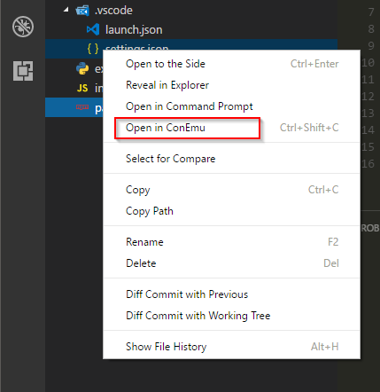
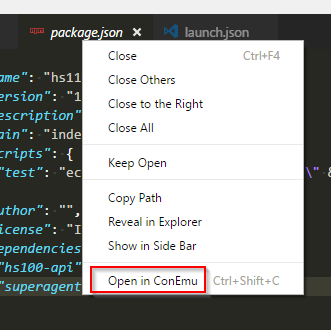
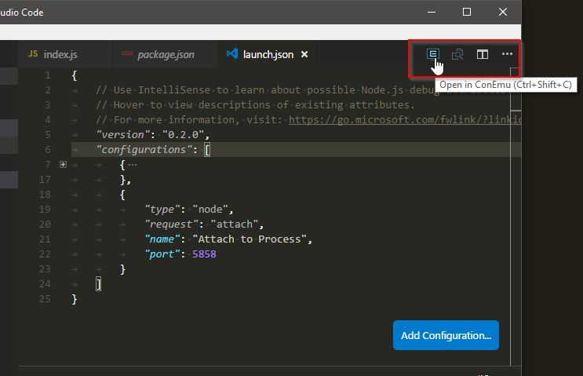

[](https://www.bithound.io/github/ipatalas/vscode-conemu/master/dependencies/npm)
[](https://www.bithound.io/github/ipatalas/vscode-conemu)

# ConEmu Launcher

This extension has been inspired by [ConEmu](https://conemu.github.io/), a great console replacement.
I've been using it for years now and really cannot imagine life without it on Windows. I know there are other great replacements but this suits me best so far.

However internal console terminal in VS Code does not like me or I don't like it... I always forget. No offence for it but I just prefer to have consistent console experience no matter what IDE I use.
I'm constantly switching between console and Code but I lacked the ability to quickly navigate to a file I'm working on in console. This isn't necessary for git but for some actions I've noticed it would be nice to have such possibility.
Writing extensions for Code is really easy so here we are...

## Features

Extension contributes one command:

* `Open in ConEmu`: opens ConEmu console window in current file's path

> Note: If the command cannot infer filepath from current document (untitled unsaved files) it opens the project folder.

This command can be executed directly from **Command Pallete** or from keyboard shortcut (default: *Shift-Alt-C*)  
It's also available from few other places shown below:

* File explorer context menu:



* File tab context menu:



* Titlebar button (hidden by default settings, see below)



To overwrite default **Command Prompt** (plain old ugly cmd) shortcut with **ConEmu** just put the following section into *keybindings.json*

```JSON
{
	"key": "ctrl+shift+c",
	"command": "vscode.conemu",
	"when": "!terminalFocus"
}
```

## Requirements

This extension is meant to be used only on Windows as obviously ConEmu is available there. It won't crash on other systems though, but won't work there as well.

## Extension Settings

This extension contributes the following settings:

* `ConEmu.path`: full path to ConEmu executable (ConEmu.exe/ConEmu64.exe)
* `ConEmu.reuseInstance`: open console in existing instance or always new window
* `ConEmu.showTitlebarIcon`: show button in title bar (default: false)

## Release Notes
### 1.0.0

Initial release

---

**Enjoy!**
